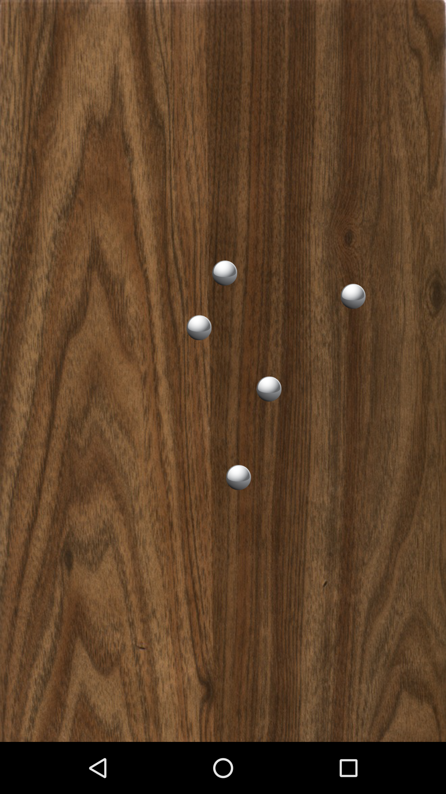

Android AccelerometerPlay Sample
===================================

Sample demonstrating how to use an accelerometer sensor as input for a physics-based view.

Introduction
------------

This sample demonstrates how to use an accelerometer [sensor][1] as input for
a physics-based view. The input from the accelerometer is used to simulate a
virtual surface, and a number of free-moving objects placed on top of it.

Any effects from the device's acceleration vector (including both gravity and
temporary movement) will be translated to the on-screen particles.

[1]: https://developer.android.com/reference/android/hardware/Sensor.html

Pre-requisites
--------------

- Android SDK 23
- Android Build Tools v24.0.0 rc1
- Android Support Repository

Screenshots
-------------

 

Getting Started
---------------

This sample uses the Gradle build system. To build this project, use the
"gradlew build" command or use "Import Project" in Android Studio.

Support
-------

- Google+ Community: https://plus.google.com/communities/105153134372062985968
- Stack Overflow: http://stackoverflow.com/questions/tagged/android

If you've found an error in this sample, please file an issue:
https://github.com/googlesamples/android-AccelerometerPlay

Patches are encouraged, and may be submitted by forking this project and
submitting a pull request through GitHub. Please see CONTRIBUTING.md for more details.

License
-------

Copyright 2016 The Android Open Source Project, Inc.

Licensed to the Apache Software Foundation (ASF) under one or more contributor
license agreements.  See the NOTICE file distributed with this work for
additional information regarding copyright ownership.  The ASF licenses this
file to you under the Apache License, Version 2.0 (the "License"); you may not
use this file except in compliance with the License.  You may obtain a copy of
the License at

http://www.apache.org/licenses/LICENSE-2.0

Unless required by applicable law or agreed to in writing, software
distributed under the License is distributed on an "AS IS" BASIS, WITHOUT
WARRANTIES OR CONDITIONS OF ANY KIND, either express or implied.  See the
License for the specific language governing permissions and limitations under
the License.
